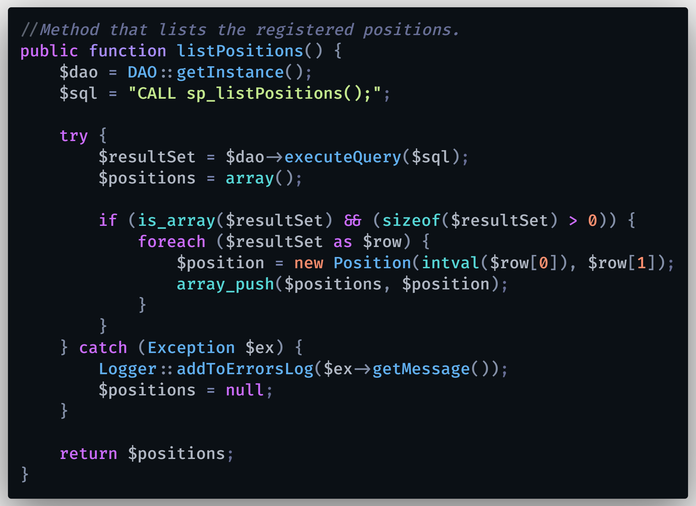

# Cómo Desplegar REST API con PHP y MySQL en Hosting de SiteGround | Publica tu API (Paso a Paso) ✅

## Link del video: https://youtu.be/dsxIJJAZRg8

🔴 *** HOSTING RECOMENDADO *** 
SiteGround: https://www.siteground.com/index.htm?afcode=6e865fc108e1834c7b6352096eb787b2 

Aprende a subir tu REST API a un hosting web, de una forma sencilla y utilizando un dominio personalizado, gracias a SiteGround. Conoce cómo publicar una REST API o cualquier aplicación web a un hosting web y poder compartirla a través de un dominio específico y dedicado a tu sistema web.

  

# 🌍 Por si deseas contactarme 👨‍💻 :

